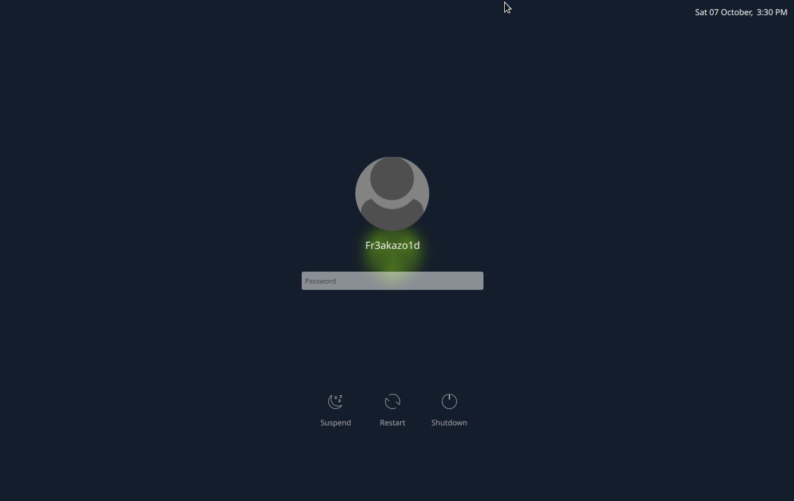

# HackTheBox Login

ts a hackthebox based theme for KDE. Its not finished but i will work on it. 

### License

This project is licensed under the GPLv3 License - see the [LICENSE](LICENSE.md) for details

### Acknowledgments

Original code is taken from KDE plasmas breeze theme. In specific the SDDM login theme written by [David Edmundson](davidedmundson@kde.org).

### Coffee
In the past years I have spent quite some hours on open source projects. If you are the type of person who digs attention to detail, know how much work is involved in it and/or simply likes to support makers with a coffee or a beer I would greatly appreciate your donation on my [PayPayl](https://www.paypal.me/marianarlt) account.
